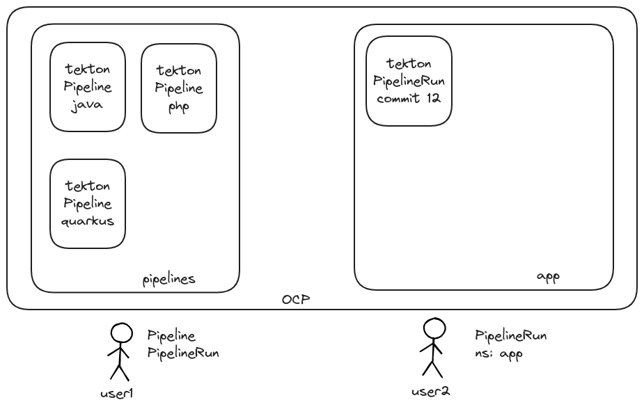

Example how to share pipeline definitions between namespaces.

# Introduction

In this example, we have a user who has some pipeline definition in a namespace and he wants to share it between namespaces. 

# Configuration

For this example, I'm using:
* OpenShift 4.15
* Openshift Pipelines 1.14.4 base on tekton 0.56.4
